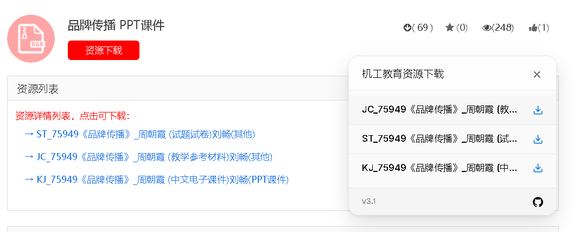

# Cmpedu Downloader

机械工业出版社教育服务网资源下载，无需登录，无需教师权限，油猴脚本。

## 如何使用

[点击安装油猴项目](https://greasyfork.org/scripts/483095)

进入书籍或资源详情页自动显示下载面板

支持以下网址格式：

- `http://www.cmpedu.com/books/book/12345.htm`
- `http://www.cmpedu.com/ziyuans/ziyuan/12345.htm`
- `http://m.cmpedu.com/books/book/12345.htm`
- `http://m.cmpedu.com/ziyuans/ziyuan/12345.htm`

## 免责声明

**用途限制**
本项目仅供学习、研究及技术探讨使用，请勿将其用于任何违反法律法规或第三方服务条款的活动。

**责任声明**
使用者须自行评估本程序的适用性和合法性。作者不对任何因使用本项目而导致的直接或间接后果负责，包括但不限于数据泄露、服务封禁或其他法律纠纷。

**删除要求**
如果您选择下载或使用此代码，请在下载后 **24 小时内删除**。这是为了确保用户在合理时间内用于学习或研究目的，避免可能的滥用风险。

本项目与相关网站及其相关机构无任何关联。

本项目为开源项目，仅供技术交流使用。禁止将本程序用于商业目的或其他违反法律法规的行为。

用户在使用本程序时须严格遵守当地法律法规，任何违反法律的行为均由使用者自行承担。

## 侵权联系

如果您认为本项目侵犯了您的合法权益（如版权或知识产权），请通过以下方式联系我们，我们将在收到相关通知后尽快处理：

1. **电子邮件**: yanyao(#)email.com（请将 `#` 替换为 `@`）
2. **GitHub Issues**: 提交详细描述的 Issue，说明相关侵权行为。

我们将认真对待每一份投诉，并在确认后采取必要措施。