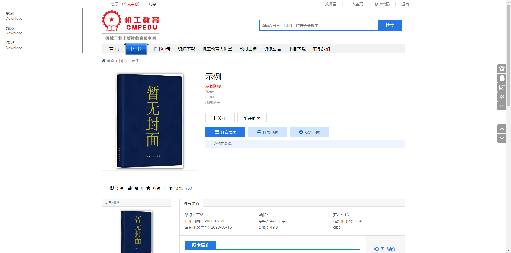

# Cmpedu Downloader

机械工业出版社教育服务网资源下载，无需登录，无需教师权限，油猴脚本。

## 如何使用

例如，当您打开`http://www.cmpedu.com/books/book/12345.htm` 或 `http://www.cmpedu.com/ziyuans/ziyuan/12345.htm`等类似网页时，脚本程序会自动在页面上显示该资源的下载链接，点击下载按钮即可下载。

[>>> 点击安装油猴脚本 <<<](https://greasyfork.org/scripts/483095)

## 演示

。

## 声明

**本程序仅供学习交流之用，禁止非法使用。**

请确保您在使用本程序时遵守相关法律法规，任何误用或非法使用均由用户个人承担责任， 作者对误用或非法使用不承担任何责任。

如果您选择下载此代码，我们建议您在 24 小时内将其删除，这是为了确保您在之后的有限的时间内使用该代码，以防止滥用或非法行为。

## 侵权联系

如果您认为本程序侵犯了您的版权或知识产权，请通过以下方式联系我们删除：

- 发送电子邮件至 yanyao(#)email.com

- 在Github上提交`issues`，详细说明侵权行为

我们将尽快回复您的问题，并采取适当措施解决侵权问题。